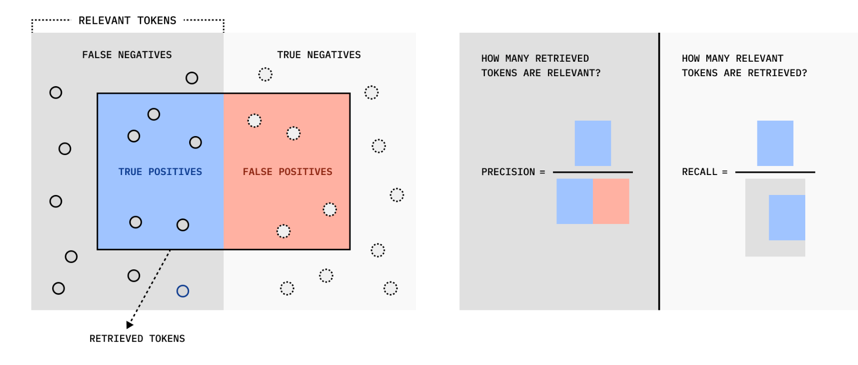

# Chunking and Relationship Extraction Evaluation
This benchmark is based on the research conducted by ChromaDB (https://research.trychroma.com/evaluating-chunking)
It evaluates the retrieval performance of different chunking methods of varyiing size and overlap + different context 
size. 
1. Token-Chunker
2. Sentence Chunker
3. Recursive Chunker
4. Cluster Chunker (work in progress)

Furthermore, it investigates which chunking method results in the best overall retrieved relationships during 
Graph-RAG (only relationships).

## Chunking 
Existing Information (IR) Retrieval Benchmarks typically
evaluate performance at a whole-document level and focus on ranking (like nDCG). 
This is, however, not ideal for (RAG) type systems. In RAG 
1. Token-level relevance is key: Only specific parts (tokens) of documents might be relevant to a query.
2. Presence over rank: LLMs are often insensitive to the exact order of relevant information in 
the context window, as long as it's present.
3. Chunking impact: The way documents are split into chunks significantly
affects what information is retrieved and presented to the LLM.
Chroma suggests a shift from evaluating on a document-level basis to a token level. The core idea is
to measure how well the tokens within the retrieved chunks align with the tokens within the ground-truth 
relevant excerpts. As such, chroma introduces token-wise Intersection over Union (IoU), 
alongside token-wise Precision and Recall. 

## Chroma Dataset:
Synthetically generated questions from different data domains:
They selected five diverse corpora:
State of the Union Address 2024 (clean), 
Wikitext (clean), 
Chatlogs (messy, with JSON), 
Finance (ConvFinQA, complex), 
and Pubmed (biomedical)
https://github.com/brandonstarxel/chunking_evaluation/tree/main/chunking_evaluation/evaluation_framework/general_evaluation_data/corpora

## Evaluation Metrics

* $T_e$: The set of **unique** tokens that constitute all *relevant excerpts* (ground truth)
* $T_r$: The set of **unique** tokens that constitute all **retrieved chunks**

### Intersection over union
Intersection over Union (IoU), also commonly referred to as the Jaccard Index,
represents a crucial metric that finds frequent application in image specific
deep learning evaluation tasks i.e., segmentation, object detection and classification.

In object detection, localization aims to draw 2D bounding boxes around objects.
To evaluate the accuracy of a predicted bounding box compared to the ground
truth (manually annotated box), the Intersection over Union (IoU) metric is used.
IoU calculates the ratio of the intersection area (the overlapping area between the 
predicted and ground truth boxes) to the union area (the total area covered by both boxes).

https://www.baeldung.com/cs/object-detection-intersection-vs-union

Mathematically this can be written as follow: 
$$
IoU = \frac{|A \cap B|}{|A \cup B|} = \frac{|I|}{|U|}
$$

### Token-wise Intersection over Union (IoU) / Jaccard Index:
**Idea**: This metric measures the similarity between the set 
of relevant tokens and the set of retrieved tokens. 
It's like asking: "Of all the unique tokens involved (either relevant or retrieved), what proportion are in both sets?" It penalizes both missing relevant tokens and retrieving too many irrelevant tokens.
In this metric:
- Numerator counts each relevant token only once (handles overlapping chunks)
- The denominator counts all retrieved tokens (penalizes redundancy)

$$
\text{IoU}_q (\mathbf{C}) = \frac{|t_e \cap t_r|}{|t_e| + |t_r| - |t_e \cap t_r|}
$$

**True Positives (TP)**: These are the tokens that are both relevant AND retrieved. Mathematically,
 $TP =|t_e \cap t_r|$. These are the solid-line circles within the blue area in the diagram.

**False Positives (FP)—Type 1 Error**:These are tokens that are retrieved BUT are NOT relevant. 
The RAG system has incorrectly identified these as relevant. These are the dashed-line circles within 
the red area (labeled "FALSE POSITIVES"). This area is part of "RETRIEVED TOKENS" but outside of
"RELEVANT TOKENS". Mathematically = $FN=∣T_r∖T_e∣$

**False Negative (FP)-Type 2 Error**: These are tokens that are relevant BUT were NOT retrieved. 
The RAG-System has missed these chunks. In the diagram, these are represented as the solid-line circles in the 
area labeled "FALSE NEGATIVES". Mathematically = $FN=∣T_e∖T_r∣$

**True Negatives (TN)**: These are tokens that are neither relevant NOR retrieved. Your system correctly ignored them.
These are the dashed-line circles in the area labeled "TRUE NEGATIVES". This area is outside both "RELEVANT TOKENS" and "RETRIEVED TOKENS".

### Token-Level Precision 
This metric answers the question: "Of all the unique tokens that were retrieved, 
what proportion are actually relevant?" It measures the purity of the retrieval. 
A high precision means that the system retrieves more relevant tokens than irrelevant ones.

Token-Level Precision is defined as follows:
$$
Precision_C(C) = \frac{TP}{TP + FP} = \frac{|t_e \cap t_r|}{|t_r|}$$

### Token-Level Recall
This metric addresses the question: "Of all the unique tokens that are truly relevant,
what proportion were successfully retrieved?" It measures the completeness of the retrieval 
in capturing the necessary information. A high recall means the system found most of the relevant tokens.
This metric penalizes the failure to retrieve relevant tokens (False Negatives).

$$
Recall_C(C) = \frac{TP}{TP + FN} = \frac{|t_e \cap t_r|}{|t_e|}$$

## Token-Level F1-Score
The F1-Score serves as a balanced measure between Precision and Recall. 
It answers: "How well does our retrieval system perform overall, 
considering both the purity of retrieved tokens and the completeness 
of relevant tokens retrieved?" It's the harmonic mean, which means
it gives more weight to lower values, so both precision and recall need
to be reasonably high for a good F1-score. As such, This metric is useful for finding an optimal blend, penalizing systems that are too skewed towards one extreme 
$$
F_1 = 2 \times \frac{\text{Precision} \times \text{Recall}}{\text{Precision} + \text{Recall}} = 2 \times \frac{|t_e \cap t_r|}{|t_e| + |t_r|}
$$

